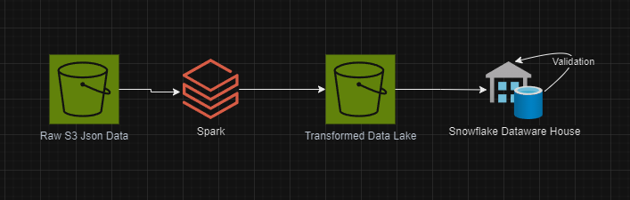

# Mini Project

## DDL
```SQL
CREATE OR REPLACE TRANSIENT TABLE techcatalyst_de.jc.SONGS_DIM (
    song_id VARCHAR,
    title VARCHAR,
    artist_id VARCHAR,
    year INT,
    duration FLOAT
);

CREATE OR REPLACE TRANSIENT TABLE techcatalyst_de.jc.USER_DIM (
    user_id INT,
    first_name VARCHAR,
    last_name VARCHAR,
    gender VARCHAR,
    level VARCHAR
);

CREATE OR REPLACE TRANSIENT TABLE techcatalyst_de.jc.TIME_DIM (
    datetime TIMESTAMP,
    start_time TIME,    
    hour INT, 
    day INT, 
    week INT, 
    month INT, 
    year INT, 
    weekday VARCHAR
);

CREATE OR REPLACE TRANSIENT TABLE techcatalyst_de.jc.ARTIST_DIM (
    artist_id VARCHAR,
    name VARCHAR,
    location VARCHAR,
    lattitude FLOAT,
    longitude FLOAT
);
```

## Diagram


## Data Lake and Data Warehouse Purpose
### Data Lake
Our data lake provides a central place to dump all of the json (semi-structured) data that Sparkify produces.
Because S3 is schema-less, it allows our logs and other data to change over time, while still being written to the same place.
We can also leverage tools like Athena to get a quick understanding of the general shape of this data.

### Data Warehouse
The data warehouse converts the semi-structured data in our data lake to structured data.
Coupled with the star schema in our data warehouse allows for easy querying. 
Moreover, snowflake is optimized for large analytics meaning Sparkify will be able to scale their company without fear of running out of room.

## Database Schema Design/ ETL Pipeline design justification
-- TODO

## Process Summary


